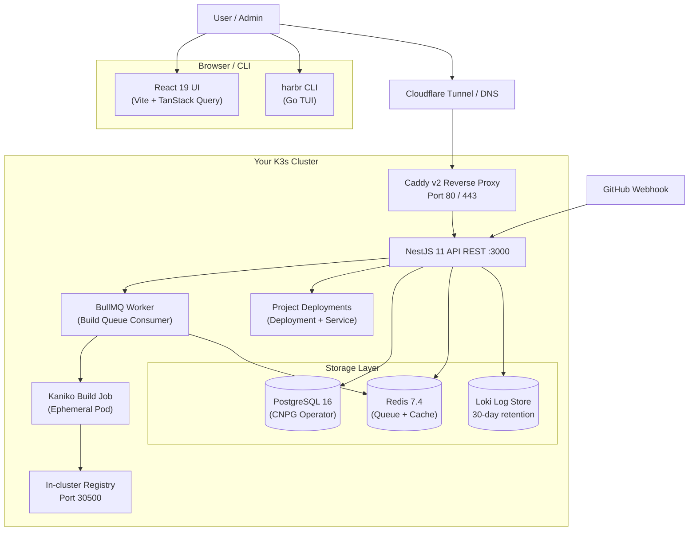
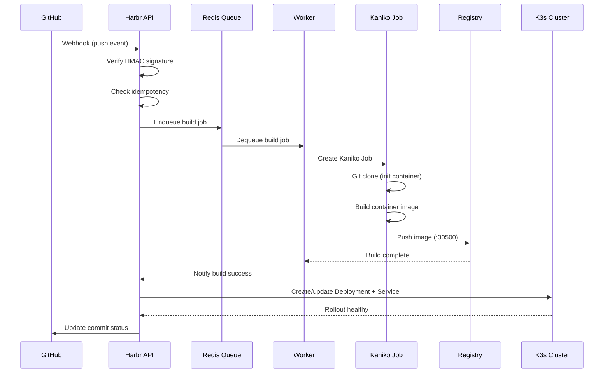

# Harbr

[](https://github.com/arunishshekhar/harbr/actions/workflows/ci.yml)
[](https://arunishshekhar.github.io/harbr)
[](LICENSE)

**Harbr** is a self-hosted PaaS that turns a cluster of bare-metal or VM nodes into a full-featured application platform — no cloud vendor lock-in, no Docker Compose spaghetti.

> Documentation site: [arunishshekhar.github.io/harbr](https://arunishshekhar.github.io/harbr)

---

## Features

| | |
|---|---|
| ⚡ **One-command deploy** | Push to Git, webhook triggers automated Kaniko build + zero-downtime rollout |
| 📦 **50+ app templates** | Databases, CMS, AI/LLM, media servers, monitoring, analytics — pre-configured |
| 🔧 **GitOps pipeline** | GitHub webhooks with HMAC verification, build cache, weekly cleanup |
| 🗂 **Multi-node cluster** | K3s + Cilium CNI + Longhorn replicated storage, secure join tokens |
| 🔒 **Network & security** | CiliumNetworkPolicy enforcement, JWT auth with jti revocation, RBAC |
| 🌐 **Three access modes** | Cloudflare Tunnel (zero open ports), Direct DNS-01, or Local-only (Tailscale) |
| 📊 **Monitoring & alerts** | Loki log aggregation (30-day), Promtail, configurable alert thresholds |
| 🖥 **CLI + Web UI** | React 19 dashboard + Go CLI with interactive TUI |
| 📋 **Audit trail** | Full CRUD audit log with monthly partitions, 90-day auto-retention |

---

## Architecture



### Deploy Pipeline



### Component Breakdown

**Go Daemon (`daemon/`)**
- `harbr` — CLI frontend with interactive TUI (setup, status, node join, logs)
- `harbrd` — background daemon with 5 goroutines:
  - **Reconciler** — every 30s, detects drift in project deployments
  - **Health** — HTTP server on `:8080/healthz` for K8s liveness probes
  - **Leader** — PostgreSQL-based lease acquisition every 15s
  - **Tunnel manager** — configures cloudflared (Tunnel mode)
  - **DNS failover agent** — monitors/fails over DNS records (Direct mode)

**NestJS API (`api/`)**
- 21 feature modules (auth, users, nodes, projects, builds, deployments, k8s, caddy, domains, storage, templates, webhooks, alerts, audit, jobs, network, logs, db_connections, system, database)
- bcrypt login + JWT with jti-based session revocation
- BullMQ build queue with stalled job re-queue on worker startup
- Scheduled tasks: daily audit partition maintenance, weekly build cache cleanup

**React UI (`ui/`) — React 19 + Vite 6 + TanStack Query 5**
- Dashboard — cluster overview with stats + node table
- Projects — data table with status badges
- Deploy — project creation form with runtime version selector
- Settings — access mode radio buttons + Cloudflare token inputs

**K8s Components** (all in `harbr-system` namespace):
- Caddy v2 reverse proxy (Longhorn PVC for certs)
- Redis 7.4 (AOF persistence on Longhorn PVC)
- Loki 2.9 (30-day retention, 20 GiB PVC)
- Promtail DaemonSet (container log shipping)
- CiliumNetworkPolicy enforcement

---

## Quick Start

### Prerequisites

- 2+ nodes running **Ubuntu 22.04 or 24.04** (x86_64 or arm64)
- **4 GB RAM, 2 CPUs, 20 GB disk** per node
- **Tailscale** installed and authenticated
- **Cloudflare account** with a domain (for Tunnel mode)

### Install

```bash
# On the primary node
curl -fsSL https://github.com/arunishshekhar/harbr/releases/latest/download/harbr-linux-amd64 -o harbr
sudo install harbr /usr/local/bin/
sudo harbr setup

# On worker nodes
sudo harbr join <join-token-from-primary>
```

The install script is idempotent — supports resume/repair, upgrade, and fresh install modes.

### Deploy Your First App

```bash
# Via CLI
harbr projects create --name myapp --git https://github.com/user/myapp.git --port 3000

# Via Web UI — open your Harbr dashboard → Deploy → fill in details → Submit

# Via Git push (after configuring webhook)
git push origin main   # triggers auto-build + deploy
```

---

## 50+ Application Templates

| Category | Templates |
|---|---|
| 🌐 **Web Frameworks** | Next.js, SvelteKit, NestJS API, FastAPI, Laravel, Rails, Payload CMS |
| 🗃 **Databases** | PostgreSQL 16, MySQL 8, Redis 7, MongoDB 7, ClickHouse, Elasticsearch, MinIO |
| 📝 **CMS** | WordPress (stack w/ MySQL), Ghost, Strapi, Directus |
| 🎬 **Media** | Jellyfin, Immich (stack w/ Redis + PG), Navidrome, Owncast |
| 🤖 **AI / LLM** | Ollama + WebUI (GPU optional), LocalAI (GPU optional), Stable Diffusion |
| 🔐 **Security / Auth** | Authentik (stack w/ PG + Redis), Authelia, Vaultwarden, WireGuard |
| 💬 **Communication** | Matrix Synapse (stack w/ PG), Mattermost, Rocket.Chat |
| 📁 **Storage & Sync** | Nextcloud, Seafile |
| 📊 **Monitoring** | Grafana + Prometheus (stack), Uptime Kuma |
| 📈 **Analytics** | Plausible (stack w/ PG + ClickHouse), Matomo, Umami |
| 🛠 **Dev Tools** | VS Code Server (code-server), Woodpecker CI (stack w/ PG) |
| 🌍 **VPN / Network** | Headscale, Netbird, WireGuard |
| 📄 **Git Hosting** | Gitea, Forgejo |
| ✉️ **Email** | Mailu, Stalwart |

---

## Tech Stack

| Component | Technology |
|---|---|
| **Daemon** | Go 1.24 (pgx, zap) |
| **API** | Node 24, NestJS 11 (BullMQ, JWT, Passport) |
| **UI** | React 19, Vite 6, TanStack Query 5, React Router 7 |
| **Container** | K3s + Cilium CNI + Longhorn storage |
| **Database** | PostgreSQL 16 (CloudNative PG Operator) |
| **Cache / Queue** | Redis 7.4 (BullMQ) |
| **Build** | Kaniko v1.23 (in-cluster, no Docker daemon) |
| **Proxy** | Caddy v2 (DNS-01 wildcard certs) |
| **Logs** | Loki 2.9 + Promtail (30-day retention) |
| **Tunnel** | cloudflared |
| **CI** | GitHub Actions (Go 1.24, Node 24) |

---

## Project Structure

```
harbr/
├── daemon/           # Go CLI + background daemon (harbr + harbrd)
│   ├── cmd/          # Binary entrypoints
│   └── internal/     # Reconciler, health, leader, tunnel, DNS failover
├── api/              # NestJS 11 REST API + BullMQ worker
│   ├── src/          # 21 feature modules
│   └── worker/       # Build queue consumer (separate process)
├── ui/               # React 19 dashboard (Vite 6)
│   └── src/          # Pages, components, API hooks
├── k8s/              # Kubernetes manifests (Caddy, Redis, Loki, etc.)
├── templates/        # 51 application templates (YAML)
├── migrations/       # PostgreSQL schema (15 migrations)
├── scripts/          # Install, migrate, setup scripts
├── docs/             # GitHub Pages site (index, privacy, terms)
└── .github/          # CI/CD pipeline
```

## Administration

```bash
harbr status     # Cluster health
harbr nodes      # List cluster nodes
harbr projects   # List all projects
harbr logs myapp # Stream real-time project logs
harbr events     # Hardware event feed
harbr version    # Version info
harbr update     # Self-update via SSH-triggered updater
```

## Development

```bash
# API
cd api && npm install && npm run start:dev

# UI
cd ui && npm install && npm run dev

# Daemon
cd daemon && go run ./cmd/harbr

# Tests
cd api && npm test              # 24 unit tests (Jest)
cd api && npm run test:e2e      # Integration + security + failure tests
cd daemon && go test ./...      # Go tests
```

## Database Migrations

```bash
./scripts/migrate.sh
```

Environment: `HARBR_DB_NAME`, `HARBR_DB_USER`, `HARBR_DB_PASSWORD`, `HARBR_DB_HOST`, `HARBR_DB_PORT`.

## Security

- **Authentication**: bcrypt password hashing (cost 12), JWT with jti-based revocation
- **Authorization**: RBAC — admin, operator, deployer, viewer roles
- **Rate limiting**: 20 req/s short window, 200 req/min long window
- **Network policies**: CiliumNetworkPolicy restricts Caddy admin API to harbr-api only
- **Proxy validation**: blocks K3s pod/service CIDRs, Tailscale, Docker internal, and sensitive ports
- **Webhook verification**: HMAC-SHA256 signed payloads, idempotent delivery tracking

## License

MIT
